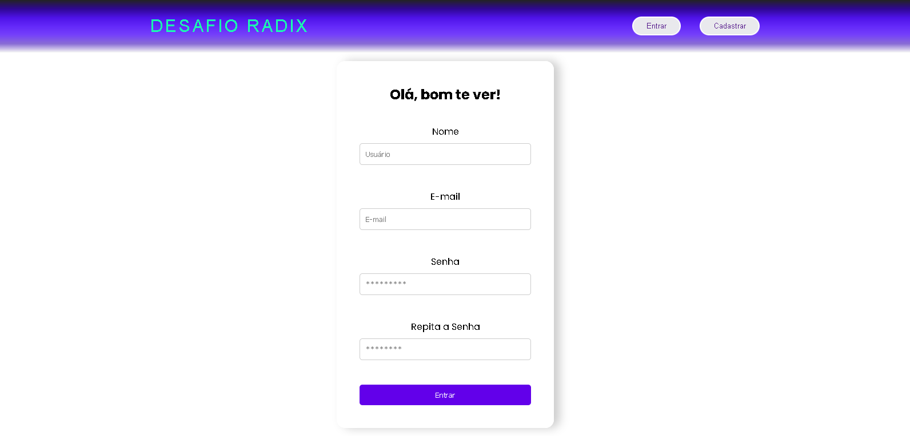

# desafioRadix

Olá! Este é meu projeto para monitoramento de sensores na indústria de óleo e gás.

Para começar a utilizar, primeiramente abra o terminal no diretorio e utilize o comando:

npm install

Assim você instalara as dependências do projeto e logo após dê o comando:

npm start

ele vai iniciar tanto o vite/react quanto o apollo junto ao GraphQL. 

Ao entrar você pode se redirecionar ao cadastro ou login caso tenha uma conta.

e após confirmar as credênciais você pode entrar e conferir os dados dos sensores

